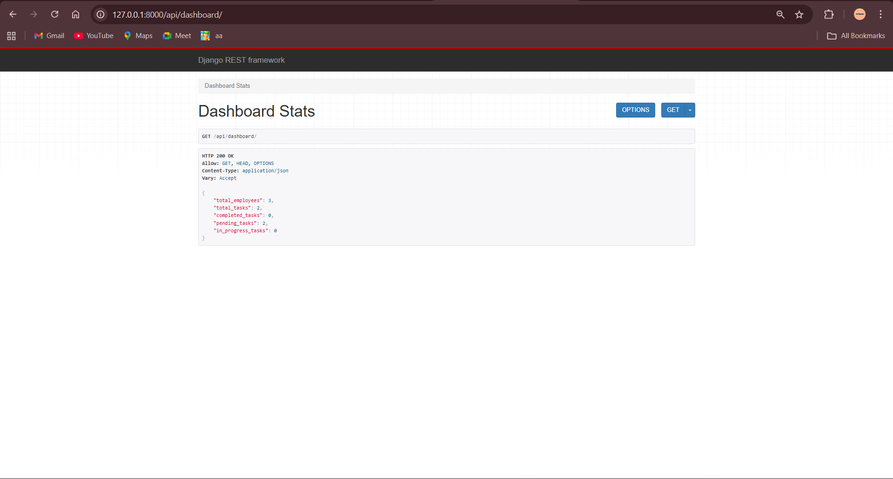
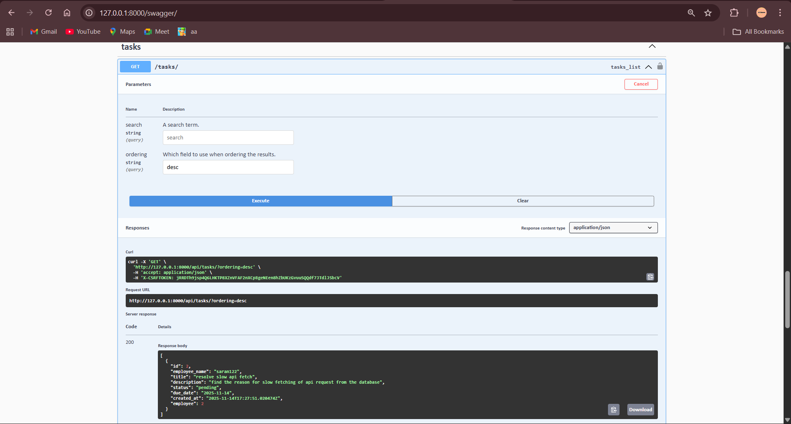
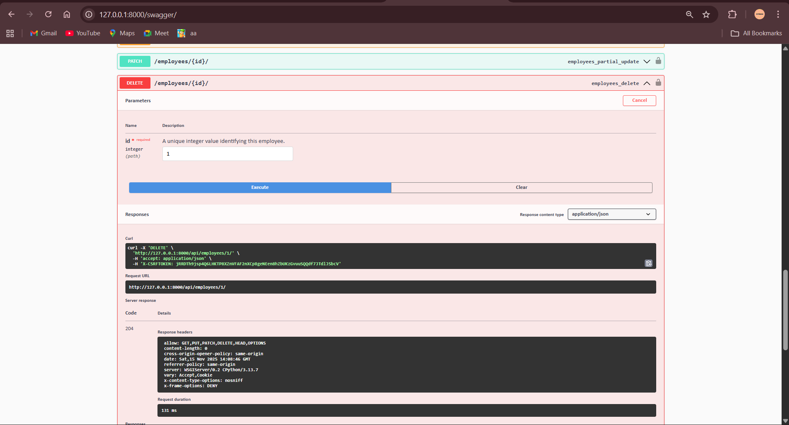

# EMPLOYEES AND TASK MANAGER API
  A clean, modular, and fully documented backend system for managing Employees and Tasks, built using Django REST Framework.
This project was developed as part of the ProU Backend Internship Assessment and follows all required functionalities — with multiple bonus enhancements added.

**📘 Overview**
This backend system provides APIs for:

* Managing Employees
* Managing Tasks
* Viewing Dashboard-level analytics
* API documentation via Swagger & ReDoc
* Clean, styled homepage with quick navigation
* The project is structured to be simple, scalable, and readable — ideal for production and onboarding use.

# 🎯 Features
**✅ Core Requirements**

* Create, List, Update, Delete Employees
* Create, List, Update, Delete Tasks
* Assign tasks to employees
* Dashboard summary statistics
* Proper relational database models

**🧪 Bonus Features**

* JWT authentication
* Search, Filter, Ordering features
* Swagger UI for api testing
* Styled homepage UI

# 🧰Tech Stack  
---------------------------------------------------------------------
| Category               | Tools / Technologies                     |
| ---------------------- | ---------------------------------------- |
| **Language**           | Python 3.13                              |
| **Framework**          | Django 5.x, Django REST Framework        |
| **Documentation**      | Swagger (drf_yasg), ReDoc                |
| **Database**           | SQLite (local), PostgreSQL-ready         |
| **Authentication**     | JWT + Session Auth (DRF)                 |
| **Deployment**         | Railway                                  |
| **Frontend (Minimal)** | HTML, CSS                                |
| **Utilities**          | Django Filters, Whitenoise, CORS Headers |
---------------------------------------------------------------------

# ⚙️ Setup & Installation
1️⃣ Clone the Repository
git clone https://github.com/Saran-ST/ProU-Backend-Assessment-.git
cd ProU-Backend-Assessment-

2️⃣ Create & Activate Virtual Environment
python -m venv venv
venv\Scripts\activate    

3️⃣ Install Dependencies
pip install -r requirements.txt

4️⃣ Apply Migrations
python manage.py migrate

5️⃣ Run Development Server
python manage.py runserver

Local URL
http://127.0.0.1:8000/

# 📸 Screenshots
Below are some UI & API screenshots of the Event Management System.

## 🏠 Home Page

## 📊 Dashboard

## 👥 Employees List

## 📥 Get Employees API

## 📝 Tasks List

## 📤 Get Tasks API

## ❌ Delete Employee API

## 📘 Swagger UI Documentation

# 🔗 API Endpoints**
**Employees**
----------------------------------------------------------
| Method    | Endpoint               | Description       |
| --------- | ---------------------- | ----------------- |
| GET       | `/api/employees/`      | List employees    |
| POST      | `/api/employees/`      | Create employee   |
| GET       | `/api/employees/<id>/` | Retrieve employee |
| PUT/PATCH | `/api/employees/<id>/` | Update employee   |
| DELETE    | `/api/employees/<id>/` | Delete employee   |
----------------------------------------------------------

**Tasks**
--------------------------------------------------
| Method    | Endpoint           | Description   |
| --------- | ------------------ | ------------- |
| GET       | `/api/tasks/`      | List tasks    |
| POST      | `/api/tasks/`      | Create task   |
| GET       | `/api/tasks/<id>/` | Retrieve task |
| PUT/PATCH | `/api/tasks/<id>/` | Update task   |
| DELETE    | `/api/tasks/<id>/` | Delete task   |
--------------------------------------------------

**📌 Assumptions**
* No authentication restriction was required for core CRUD operations (as per task instructions).
* SQLite is used for development but the project can run on PostgreSQL without code changes.
* Admin login is optional; not required for task CRUD operations.
* This is a backend-focused assessment — frontend is intentionally minimal.

**✍️ Author**
Saran ST
B.E. Electronics & Communication Engineering
Sri Venkateswara College of Engineering (2022–2026)
🔗 GitHub: https://github.com/Saran-ST

